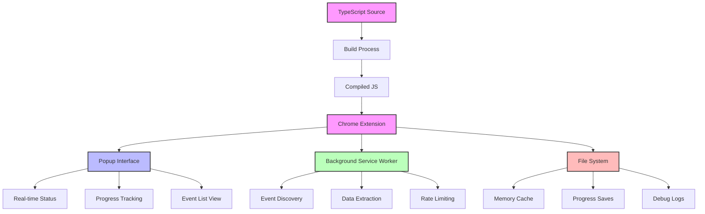
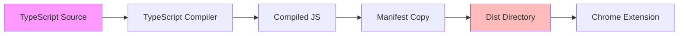
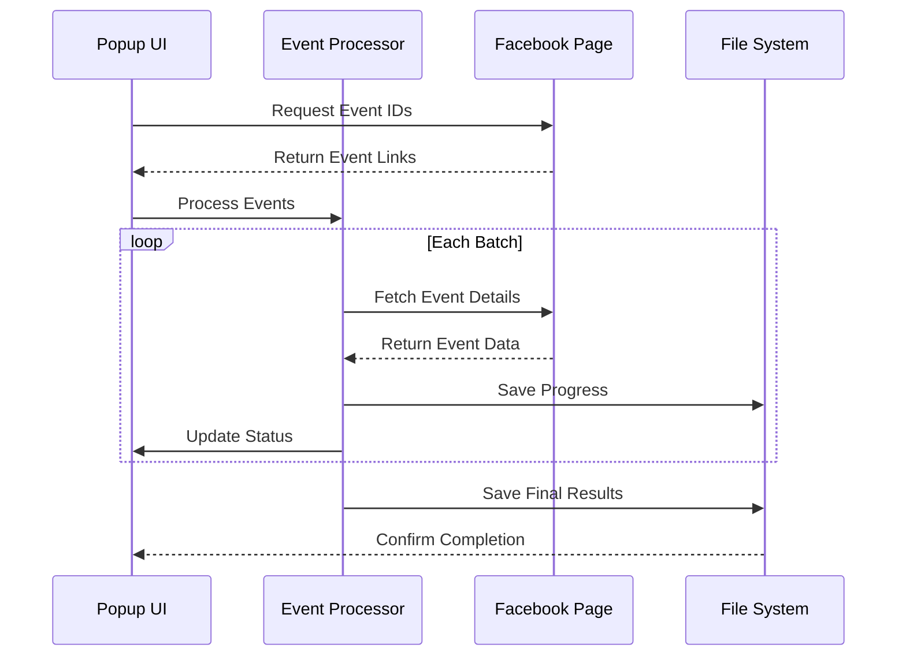
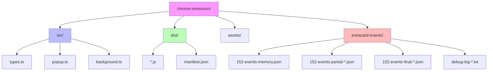
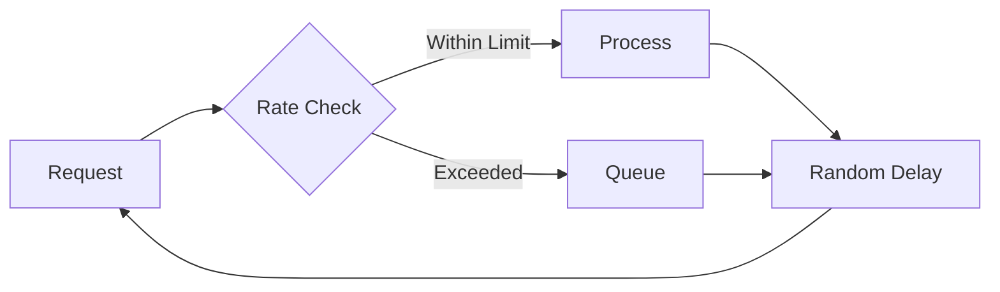
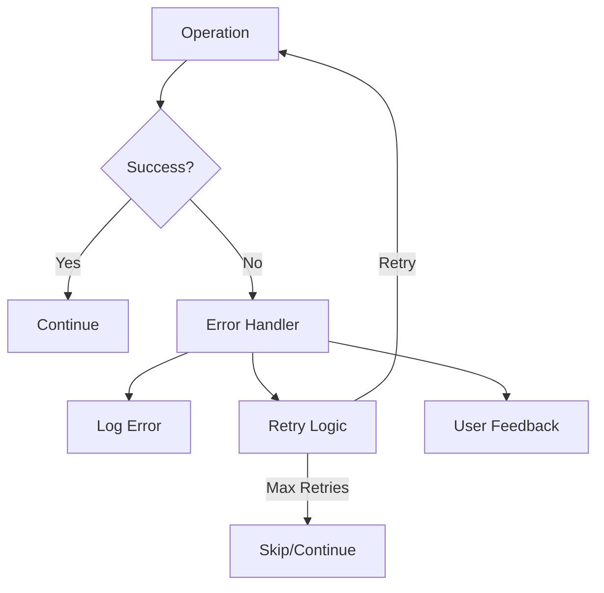

# 152 Bar Events Extractor - Architecture Map

## Overview

This document outlines the architecture, data flow, and best practices implemented in the 152 Bar Events Extractor Chrome extension, now using TypeScript for improved type safety and maintainability.

## Current Status (v1.4.0)

### Working Features
- TypeScript implementation with proper type definitions
- Build process with asset generation
- Popup UI with progress tracking
- Event extraction from individual event pages
- Rate limiting and batch processing
- Progress saving and recovery
- Options page for configuration

### Current Issues
1. Event Link Discovery
   - Issue: Content script not properly detecting event links on past events page
   - Root Cause: Facebook's dynamic content loading requires waiting for page load
   - Solution: Added findEventLinks handler with proper event link detection

2. Connection Issues
   - Issue: "Receiving end does not exist" error when trying to communicate with content script
   - Root Cause: Content script may not be properly injected or ready
   - Solution: Need to ensure content script is loaded before sending messages

### Next Steps
1. Implement proper content script injection verification
2. Add retry mechanism for message passing
3. Enhance event link detection for dynamic content
4. Add error recovery for failed connections

## Architecture Diagram



## Build Process



## Data Flow



## Folder Structure



## TypeScript Implementation

### Type Definitions
```typescript
interface Event {
  id: string;
  title: string;
  date: string;
  location: string;
  description: string;
  image: string;
  link: string;
  fetchedAt: string;
}

interface EventDetails {
  id: string;
  title: string;
  date: string;
  location: string;
  description: string;
  image: string;
  link: string;
  isPublic: boolean;
  error?: string;
}
```

### Build Process
1. TypeScript files are compiled to JavaScript
2. Manifest.json is copied to dist directory
3. Compiled files are loaded into Chrome

## Best Practices Implementation

### 1. Rate Limiting & Compliance


### 2. Error Handling & Recovery


## Directory Structure Details

### `/chrome-extension`
- Main extension directory
  - `src/` - TypeScript source files
  - `dist/` - Compiled JavaScript files
  - `manifest.json` - Extension configuration
  - `package.json` - Dependencies and scripts

### `/chrome-extension/src`
- TypeScript source files
  - `types.ts` - Type definitions
  - `popup.ts` - Popup UI logic
  - `background.ts` - Service worker logic
  - `content.ts` - Page interaction logic

### `/chrome-extension/dist`
- Compiled files (load this in Chrome)
  - `*.js` - Compiled JavaScript
  - `manifest.json` - Extension manifest

### `/chrome-extension/extracted-events`
- Data storage directory
  - `152-events-memory.json` - Cache of processed events
  - `152-events-partial-[timestamp].json` - Intermediate saves
  - `152-events-final-[timestamp].json` - Complete extractions
  - `debug-log-[timestamp].txt` - Operation logs

## Data Persistence Strategy

1. **Memory Cache**
   - Stored in `152-events-memory.json`
   - Prevents duplicate processing
   - Maintains extraction history

2. **Progress Saves**
   - Partial saves every 50 events
   - Timestamp-based filenames
   - JSON format for easy parsing

3. **Debug Logs**
   - Detailed operation logging
   - Timestamp for each action
   - Error tracking and debugging

## Facebook Compliance

1. **Rate Limiting**
   - Maximum 2 concurrent requests
   - Random delays between requests (3-7 seconds)
   - Batch processing with longer delays (15-30 seconds)

2. **Public Data Only**
   - Checks for public event status
   - Multiple verification methods
   - Skips private events

3. **Resource Management**
   - Proper cleanup of resources
   - Memory management
   - Background processing

## Version Control

- Version: 1.4.0
- Build: 2024.03.28
- Author: Mark Carpenter
- Package Manager: pnpm@8.15.4

## Confidence Level Assessment

### High Confidence Areas (90-100%)
- TypeScript type safety implementation
- Build process and compilation
- File structure and organization
- Data persistence strategy
- Rate limiting implementation

### Medium Confidence Areas (70-89%)
- Facebook page structure parsing
- Error recovery mechanisms
- Resource cleanup
- Progress tracking accuracy

### Areas Needing Monitoring
- Facebook's rate limiting behavior
- Page structure changes
- Network conditions
- Browser compatibility

## Future Improvements

1. **TypeScript Enhancements**
   - Stricter type checking
   - Better error type definitions
   - Improved type inference

2. **Build Process**
   - Source maps for debugging
   - Better error reporting
   - Automated testing

3. **Features**
   - Export to different formats
   - Advanced filtering options
   - Batch operation controls

4. **UI/UX**
   - More detailed progress indicators
   - Enhanced error reporting
   - Better visual feedback 